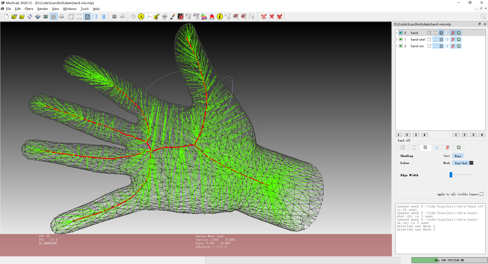

# Scan2knit project

An implementation of "Automatische Herstellung von 3D-gestrichten technischen Textilien" (Automated Production of 3D knitted Technical Textiles).

## Dependencies

The only dependencies are [CGAL](https://doc.cgal.org/latest/Manual/windows.html) and [libigl](https://libigl.github.io/tutorial/) at first. It is recommended to use [vcpkg](https://github.com/microsoft/vcpkg) to install both dependencies.

The cmake-gui build system will attempt to find cgal and libigl according to environment variables and searching in common desitinations.

Compile this project using the standard cmake-gui routine:

    mkdir build
    cd build
    cmake-gui ..

This should find and build the dependencies and create a `Scan2knit` binary.

## Run

From within the `build` directory just issue:

    ./Scan2knit xxx.off

## Image

