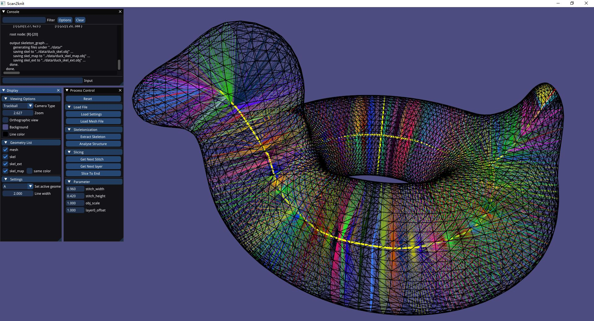
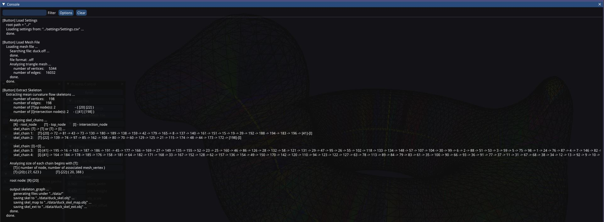
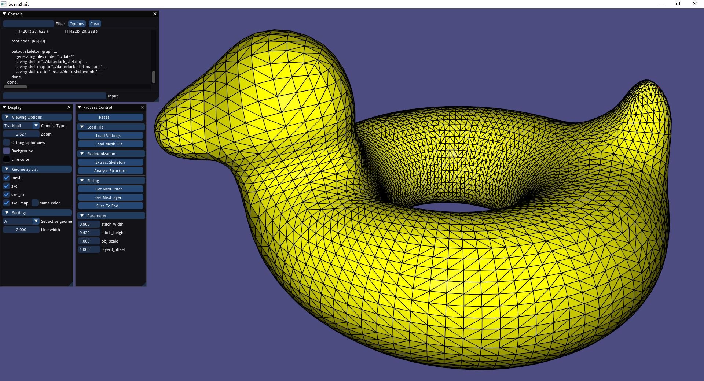
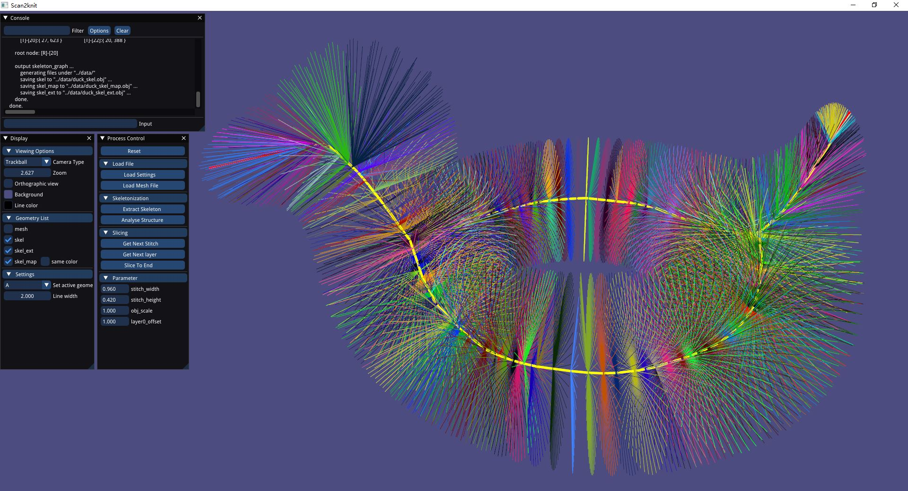
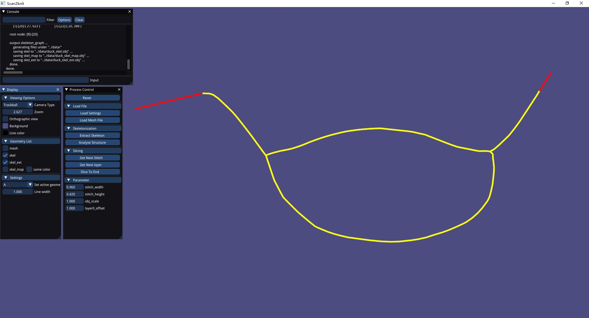
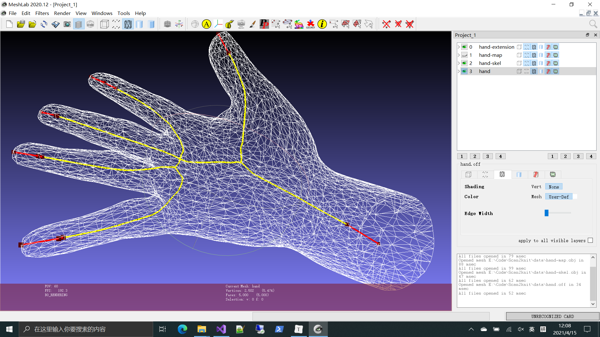

# Scan2knit project

The implementation of my master thesis "Automatische Herstellung von 3D-gestrichten technischen Textilien" (Automated Production of 3D knitted Technical Textiles).


## Status














------

## Installation

The following two sections shows how to install Scan2knit and its dependencies like [CGAL](https://doc.cgal.org/latest/Manual/windows.html) and [Libigl](https://libigl.github.io/tutorial/) on different OS.  In addition to this, you will need some other tools like [CMake](https://cmake.org/) and [Git](https://git-scm.com/) to compile and manage the source code.

### Installation on Windows

-- tested on Windows 10 Pro (x64)

Installation List 

| Software                                                     |                                                              | Installation Guide                                           |
| ------------------------------------------------------------ | ------------------------------------------------------------ | ------------------------------------------------------------ |
| [Visual Studio 2019](https://visualstudio.microsoft.com/zh-hans/) | to compile the code                                          | [Installation Guide](https://docs.microsoft.com/en-us/visualstudio/install/install-visual-studio?view=vs-2019) |
| [Git](https://git-scm.com/)                                  | to download the source code of Scan2knit                     | [Installation Guide](https://git-scm.com/book/en/v2/Getting-Started-Installing-Git) |
| [CMake](https://cmake.org/) 3.1 or later                     | to generate project file (and compile the code)              | [Installation Guide](https://cmake.org/install/)             |
| CMake-GUI                                                    | alternative                                                  |                                                              |
| [vcpkg](https://github.com/microsoft/vcpkg)                  | to install CGAL and its dependencies                         | [Installation Guide](https://github.com/microsoft/vcpkg#readme) |
| [CGAL](https://www.cgal.org/) 5.2.1 or later                 | [Documentation](https://doc.cgal.org/latest/Manual/index.html) | [Installation Guide](https://doc.cgal.org/latest/Manual/windows.html) |
| [Libigl](https://libigl.github.io/)                          |                                                              | [Installation Guide](https://libigl.github.io/#installation) |

Installation step by step:

```bash
# installing vcpkg
cd <your directory>
git clone https://github.com/microsoft/vcpkg
cd vcpkg
.\bootstrap-vcpkg.bat
vcpkg integrade install # alternative, using vcpkg with Visual Studio
(insert environment variable VCPKG_DEFAULT_TRIPLET=x64-windows) # alternative, otherwise you must add the suffix after the package name you want to install

# installing cgal
.\vcpkg.exe install yasm-tool:x86-windows
.\vcpkg.exe install cgal

# installing libigl
cd <your directory>
git clone https://github.com/libigl/libigl.git

# generating Scan2knit.sln and Debug (if you do not need to debug, skip this step)
git clone https://github.com/ZiniuLu/Scan2knit.git
cd Scan2knit
mkdir build
cd build
cmake-gui ..
(click "Configure")
	(specify the generator for this project: "Visual Studio 2019")
	(Optional platform for generator: "x64")
	(choose: "Specity toolchain file for cross-compiling")
	(click "Next" ...)
(click "Generate")
# The Solution file Scan2knit.sln is now generated under ".\Scan2kni\build\". You can now debug the code in Visual Studio

# generating Scan2knit.exe (using CMake, without Visual Studio)
cd Scan2knit
mkdir build
cd build
cmake -DCMAKE_BUILD_TYPE=Release ../
make
# The Excuable file Scan2knit.exe is now generated under ".\Scan2kni\build\".
```

This should find and build the dependencies and create a `Scan2knit` binary.

### Installation on Linux 

-- tested on Ubuntu 21.04 (amd64, doesn't work on arm cpu)

Installation List

| Software                                     |                                                              | Installation Guide                                           |
| -------------------------------------------- | ------------------------------------------------------------ | ------------------------------------------------------------ |
| [Git](https://git-scm.com/)                  | to download the source code of Scan2knit                     | [Installation Guide](https://git-scm.com/book/en/v2/Getting-Started-Installing-Git) |
| [CMake](https://cmake.org/) 3.1 or later     | to generate project file (and compile the code)              | [Installation Guide](https://cmake.org/install/)             |
| CMake-GUI                                    | alternative                                                  |                                                              |
| [CGAL](https://www.cgal.org/) 5.2.1 or later | [Documentation](https://doc.cgal.org/latest/Manual/index.html) | [Installation Guide](https://doc.cgal.org/latest/Manual/windows.html) |
| [Libigl](https://libigl.github.io/)          |                                                              | [Installation Guide](https://libigl.github.io/#installation) |

Installation step by step:

```shell
# installing git
sudo apt-get install git
git --version # to check if git is successfully installed
git config --global user.name "your name"
git config --global user.email "your email"

# installing cmake
sudo apt-get install build-essential
sudo apt-get install cmake
sudo apt-get install cmake-qt-gui # alternative

# installing cgal
sudo apt-get install libboost-all-dev # Boost
sudo apt-get install libgmp-dev # GMP
sudo apt-get install libmpfr-dev # MPFR
sudo apt-get install libeigen3-dev # Eigen3
sudo apt-get install libcgal-dev # CGAL

# installing libigl (https://libigl.github.io/tutorial/#downloading-libigl)
sudo apt-get install libx11-dev
sudo apt-get install mesa-common-dev libgl1-mesa-dev libglu1-mesa-dev
sudo apt-get install libxrandr-dev
sudo apt-get install libxi-dev
sudo apt-get install libxmu-dev
sudo apt-get install libblas-dev
sudo apt-get install libxinerama-dev
sudo apt-get install libxcursor-dev

# compiling Scan2knit
cd <your directory>
git clone https://github.com/ZiniuLu/Scan2knit.git
cd Scan2knit
mkdir build
cd build
cmake -DCMAKE_BUILD_TYPE=Release ../
make
# The excutable file Scan2knit.exe is now generated.
```

------

## Launch

From within the `build/Release` or `build/Debug` directory just issue:

    ./Scan2knit.exe "../data/xxx.off"


## Image

